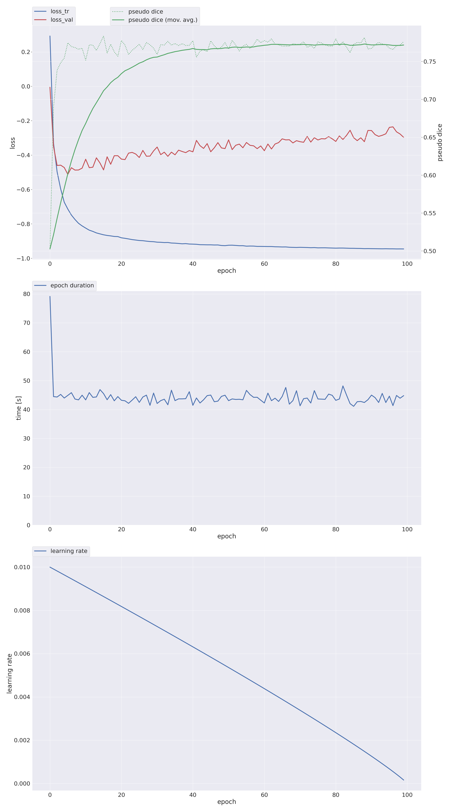
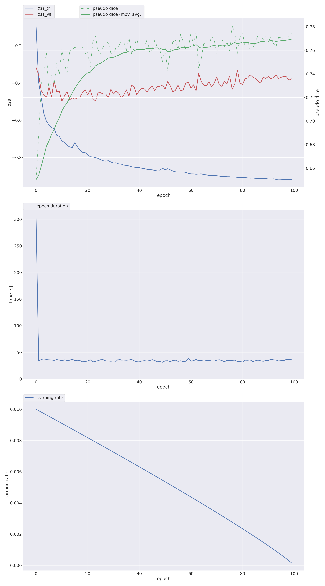
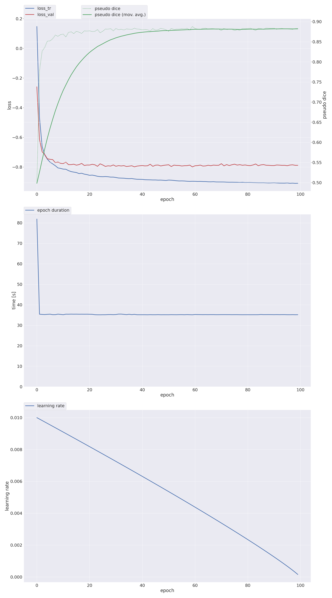

# Multi-View Cardiac MRI — Segmentation, Scar-Mass & Ejection-Fraction Quantification

Our solution to the **MICCAI MWM 2026 CMR-MULTI** challenge (Codabench&nbsp;#15533): a unified,
[nnU-Net](https://github.com/MIC-DKFZ/nnUNet)-based pipeline that handles **both** challenge tasks
across four cardiac views (SAX, 2CH, 4CH, RAS):

- **Task 1 — Cine:** multi-view segmentation **+ ejection-fraction (EF)** estimation.
- **Task 2 — LGE:** multi-view scar segmentation **+ scar-mass** quantification.

**Authors:** Youssef Araby, Rodaina Hebishy, Youssef Sharabas, Michael Atef
**Institution:** Nile University — Faculty of Informatics and Computer Science
**Course:** Deep Learning · 2026

---

## Overview

Rather than designing new networks, we build a strong, reproducible system on top of the
self-configuring **nnU-Net** framework and improve it where each task needs it:

- **Transfer-learned backbones.** The encoder slot of a 2D U-Net is swapped for ImageNet-pretrained
  backbones (EfficientNet-V2, DenseNet), studied in a confound-controlled comparison.
- **Multi-architecture ensemble (Task 2).** Six complementary members are combined by soft-vote to
  recover more scar than any single model.
- **Decoupled scar mass (Task 2).** Mask quality and mass accuracy are optimised separately: masks
  come from the ensemble, while the scar mass is read off the SAX scar voxels and corrected by a
  single scale calibration — improving the mass term **without changing the masks**.
- **EF from segmentation (Task 1).** Ejection fraction is derived from the predicted short-axis
  blood-pool volume across the cardiac cycle (volume–time curve → end-diastolic / end-systolic
  volume → EF).
- **Honest negative results.** Medical-domain pretraining (RadImageNet) and promptable foundation
  models (SAM2 / MedSAM2) were evaluated and did **not** help automatic scar segmentation.

> Earlier baseline experiments (U-Net + voxel correction, Attention U-Net) are preserved in the
> project's git history.

## The challenge

| | Task 1 — Cine | Task 2 — LGE |
|---|---|---|
| **Goal** | chamber segmentation + ejection fraction | scar segmentation + scar mass |
| **Views** | SAX, 2CH, 4CH | SAX, 2CH, 4CH, RAS |
| **Scalar target** | EF = 100·(EDV − ESV) / EDV | scar mass = n_scar · v_vox · ρ (ρ = 1.05 g/cm³), SAX only |
| **Score** | 0.7·(0.4·DSC + 0.3/(1+HD) + 0.3/(1+ASD)) + 0.3·max(0, EF-PCC) | 0.7·DSC + 0.3·(½·max(0,vPCC) + ½/(1+RAE)) |

**Overall = (Task 1 + Task 2) / 2**, so a competitive system must solve both.

Labels are **not shared** across views or tasks — e.g. label 3 is *scar* (LGE) but *RV cavity*
(Cine SAX), and RAS targets the right atrium only. All model selection uses **5-fold cross-validation
on the training patients** (LGE: 40 train / 7 val / 13 blind test; Cine: 105 train / 15 val); the
test labels are hidden.

## Results

All numbers are **out-of-fold** (each patient scored by a fold that never trained on it). Dice is
convention-dependent, so we report three regimes:

- **① Ours** — strict, per-volume Dice (our decision metric).
- **② Paper** — the challenge's per-slice convention (empty-in-both slices score 1.0); comparable to the leaderboard.
- **③ Comp.** — the challenge metric on the 7 official validation patients (external check).

**Task 2 — LGE: the ensemble across all three regimes**

| Regime | Overall DSC | Scar DSC | Task-2 |
|---|---|---|---|
| ① Ours (per-volume) | **0.753** | 0.425 | 0.698 |
| ② Paper (per-slice) | 0.762 | 0.520 | 0.704 |
| ③ Comp. (7 val) | 0.774 | 0.574 | 0.727 |

**Task 2 — per-model comparison** (regime ①, out-of-fold on the 40 training patients):

| Model | Overall DSC | Scar DSC | vPCC | Mass | Task-2 |
|---|---|---|---|---|---|
| **6-arch Ensemble** | **0.753** | **0.425** | 0.557 | 0.569 | 0.698 |
| EffNetV2-XL | 0.746 | 0.411 | 0.576 | 0.585 | 0.697 |
| EfficientNet-B7 | 0.742 | 0.400 | 0.538 | 0.569 | 0.690 |
| EffNetV2-L | 0.741 | 0.396 | 0.571 | 0.581 | 0.693 |
| DenseNet-264 | 0.739 | 0.393 | **0.650** | **0.620** | **0.704** |
| ScarTversky | 0.727 | 0.362 | 0.513 | 0.546 | 0.673 |
| PlainConv (from scratch) | 0.724 | 0.352 | 0.498 | 0.540 | 0.669 |
| DenseNet-121 (RadImageNet) | 0.718 | 0.358 | 0.568 | 0.573 | 0.674 |
| Hiera-tiny | 0.708 | 0.329 | 0.417 | 0.497 | 0.644 |
| SAM2.1-large | 0.693 | 0.294 | 0.374 | 0.472 | 0.627 |

The ensemble gives the best masks; **DenseNet-264** gives the best scar mass (vPCC 0.650). Combining
them — **ensemble mask + DenseNet-264 mass (decoupled)** — yields **Task-2 ≈ 0.713**, above any single
end-to-end model. Every ImageNet-pretrained encoder beats the from-scratch PlainConv baseline (0.724);
RadImageNet (medical pretraining) and the foundation models (Hiera, SAM2) rank lowest.

**Task 1 — Cine** (out-of-fold):

| View | Cine DSC |
|---|---|
| SAX | 0.882 |
| 2CH | 0.840 |
| 4CH | 0.856 |
| **Overall** | **0.859** |

Ejection fraction: **EF-PCC 0.916** (MAE ≈ 3.6 %). Boundary metrics: HD ≈ 12.9 mm, ASD ≈ 0.85 mm.

### Training & validation curves

Representative nnU-Net curves (per epoch: training loss, validation loss, and the pseudo-Dice
accuracy proxy). Logs and charts for every model and fold are kept with the project's training records.

**Task 2 — EffNetV2-XL (LGE):**



**Task 2 — DenseNet-264 (LGE — best scar mass):**



**Task 1 — Cine SAX:**



## Repository structure

```
common/            shared metrics (Dice, vPCC, RAE) and multi-view scar-mass combiner
nnunet/            the main pipeline (both tasks)
  trainers/        custom nnU-Net trainers — swappable pretrained encoders + Focal-Tversky loss
  convert_*.py     load external pretrained encoders into nnU-Net
  nnunet_predict.py, ens_exhaustive.py, ensemble_complementarity.py, run_ens_soft.sh   (Task 2 ensemble)
  nnunet_mass.py, oof_calibrate.py                                                      (scar mass + calibration)
  ras_warmstart.sh                                                                      (RAS expert)
  ef_pipeline.py, cine_resume.sh, cine_hdasd2.py, build_task1_submission.py             (Task 1 Cine + EF)
  oof_eval_run.py, score_their_metric.py, per_class_nested.py, master_rows.py, ...      (evaluation / scoring)
  medsam2_oracle.py, medsam2_cascade.py                                                 (foundation-model study)
gan/               SPADE / pix2pix label→LGE scar augmentation (explored)
unified_eval/      cross-track evaluation utilities
LEADERBOARD*.md    full per-view / per-class / per-regime result tables
training_pipeline.md, gan.md   method notes
```

## Getting started

```bash
git clone https://github.com/RodainaMSH/LGE-MRI-MULTIVIEW-SEGMENTATION-AND-MYOCARDIAL-MASS
cd LGE-MRI-MULTIVIEW-SEGMENTATION-AND-MYOCARDIAL-MASS
pip install -r requirements.txt
```

The CMR-MULTI dataset and trained weights are **not** included (organiser data is not redistributable,
and checkpoints are large). The scripts expect the nnU-Net dataset layout under `nnUNet_raw/`. Key
entry points:

| Step | Script |
|---|---|
| Train an ensemble member (encoder-swap U-Net) | `nnunet/trainers/nnUNetTrainerSMPEncoders.py` |
| Soft-vote the ensemble | `nnunet/run_ens_soft.sh`, `nnunet/ens_exhaustive.py` |
| Scar mass + scale calibration | `nnunet/nnunet_mass.py`, `nnunet/oof_calibrate.py` |
| RAS expert | `nnunet/ras_warmstart.sh` |
| Cine training / EF | `nnunet/cine_resume.sh`, `nnunet/ef_pipeline.py` |
| Out-of-fold evaluation (3 regimes) | `nnunet/oof_eval_run.py`, `nnunet/score_their_metric.py`, `nnunet/master_rows.py` |

## Team & contributions

| Member | Task | Contribution |
|---|---|---|
| **Youssef Araby** | Task 2 · LGE | nnU-Net pipeline; encoder-transfer study; multi-architecture soft-vote ensemble; scar-mass decoupling & calibration |
| **Rodaina Hebishy** | Task 2 · LGE | RAS expert; scar-mass quantification & multi-view combine; evaluation regimes; results analysis |
| **Youssef Sharabas** | Task 1 · Cine | Cine multi-view segmentation (per-view experts, 5-fold); data preparation |
| **Michael Atef** | Task 1 · Cine | Ejection-fraction pipeline; boundary metrics (HD / ASD); evaluation |

## Acknowledgments

Completed for the Deep Learning course at Nile University. Dataset provided by the **CMR-MULTI**
challenge (MICCAI MWM 2026). Built on [nnU-Net](https://github.com/MIC-DKFZ/nnUNet) and
[segmentation_models.pytorch](https://github.com/qubvel/segmentation_models.pytorch).

## License

Released for academic and research purposes.
